### Hi there! My name is Joris 👋

H/T to @s-weigand for the inspiration for this profile.

## ⚡ Quick facts about me

- 🎓 MSc in Physics, with a PhD in Computation Biophysics (Photosynthesis)
- 🏢 I'm currently working at [Cassini Technologies](https://cassini-technologies.com/)
- 💬 TODO

💻 Some of the technology's I use

TODO

 :octocat: My Github stats

 
